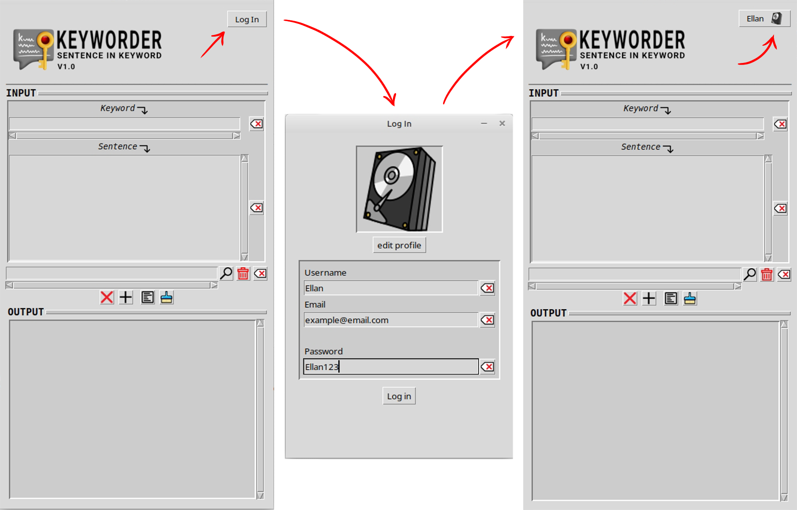
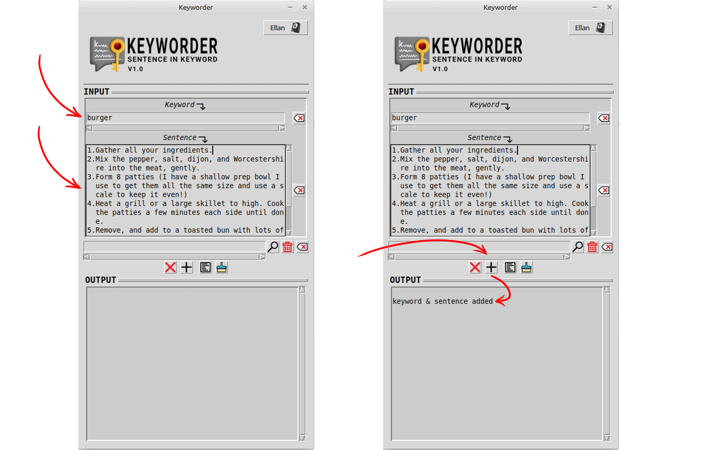
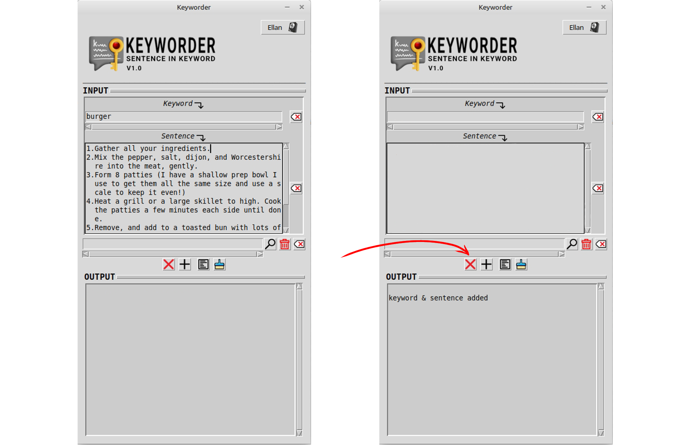
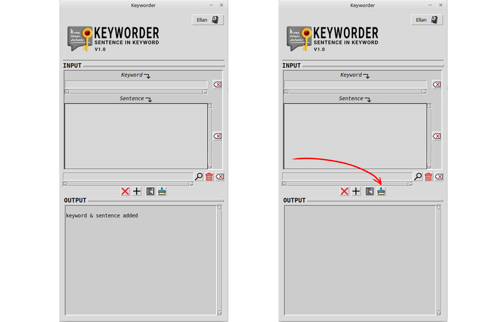
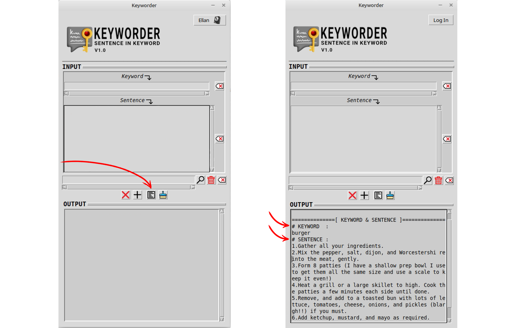
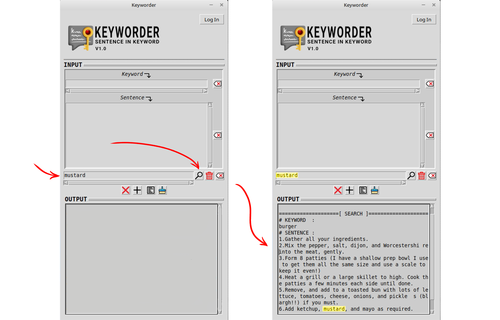
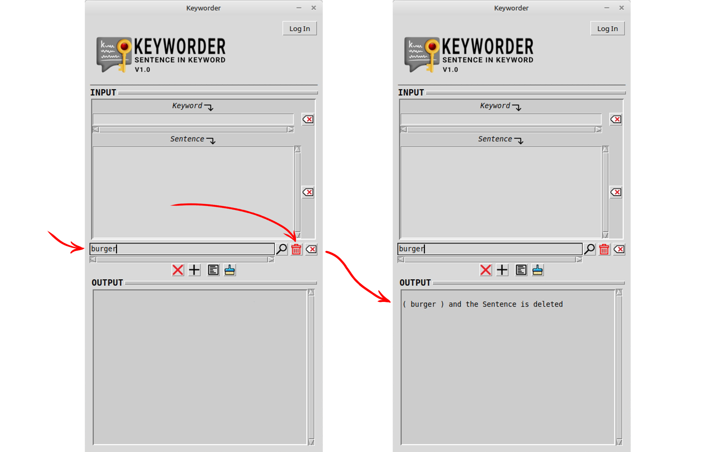
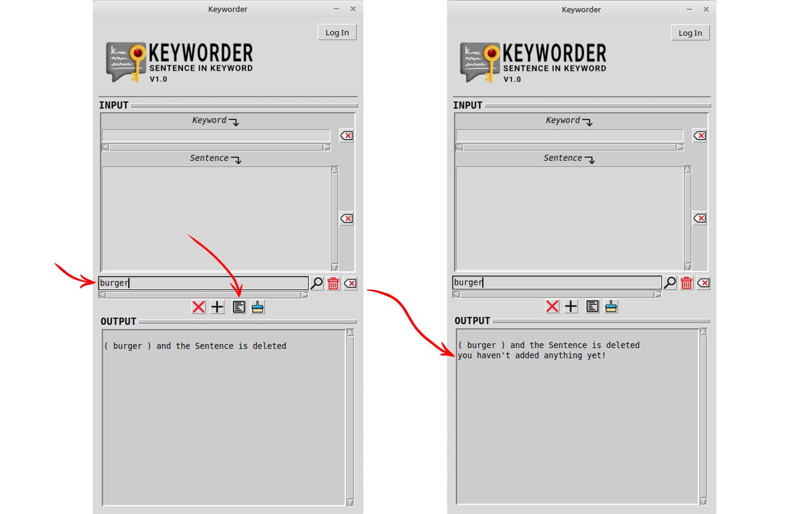

# Keyworder
A simple application made in Python, this application functions to store long sentences in a single word

## How to use Keyworder
1. Press the login button in the top right corner to create an account (optional), the application will not save your data and will not check whether your email account exists or not, because it only logs in to the UI with a simple login system.

After logging in, your name and profile picture will appear in the top right corner, replacing the previous login button.

###
2. Enter your keywords and sentences, then click the add icon button to save the keywords and sentences.

###
3. Click the red cross icon button to delete the keyword input and sentence input at the same time.

###
4. Click the blue broom icon button to clean the output box.

###
5. Click the show all icon button to see all the keywords and sentences you have added previously.

###
6. Imagine we have a lot of keywords and sentences, and we want to search for specific keywords and sentences, what we need to do is enter the words contained in the keywords or sentences that we want to search for into the search bar and press the search icon button.

Later, all keywords and sentences containing the words we entered into the search bar previously will appear.

###
7. To delete keywords and sentences, enter the keyword into the search bar, then press the red trash icon button.

###
8. To just make sure whether the keywords and sentences have been properly deleted, you can press the show all icon button to check.

The output box displays the output "you haven't added anything yet!", which means that we have successfully deleted the keywords and sentences.

